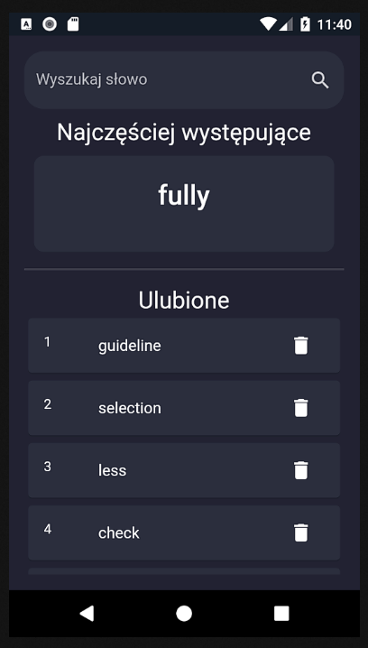
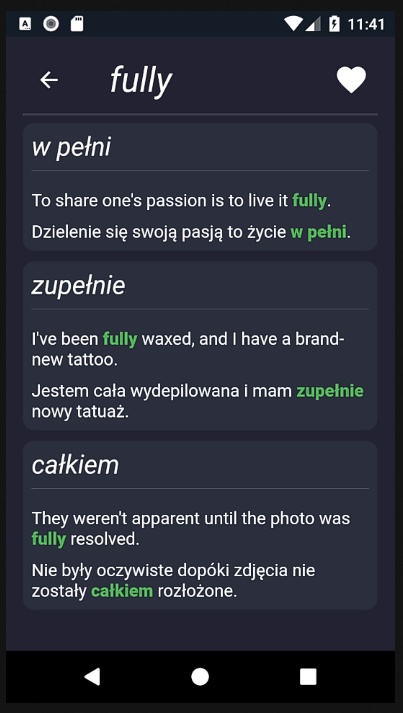

# English vocab
Flutter application which translates english vocabulary to polish language with examples. It contains 3000 most common words according to "https://www.ef.com/wwen/english-resources/english-vocabulary/top-3000-words/". User may also look for a word using a search bar. The application scraps the "https://glosbe.com/" page. 

# Screens
## Home page

## Translation page

